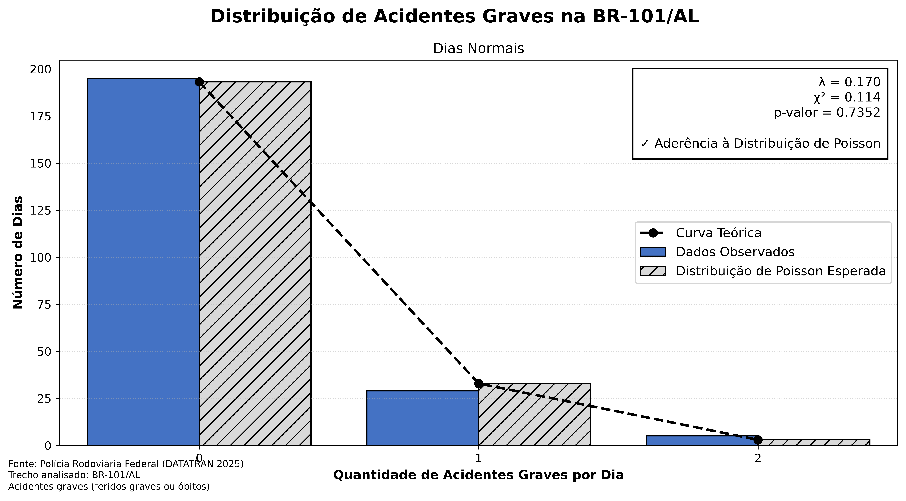
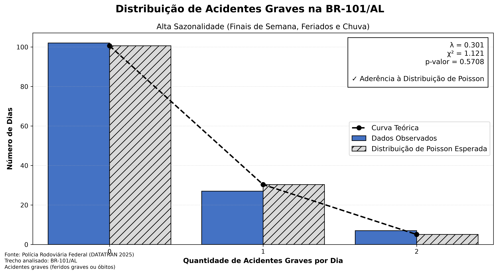

# Modelagem Estocástica de Acidentes Graves na BR-101/AL

[](https://www.python.org/)
[](https://pandas.pydata.org/)
[](https://scipy.org/)
[](https://matplotlib.org/)
[](https://www.gov.br/prf/pt-br/acesso-a-informacao/dados-abertos/dados-abertos-da-prf)
[](LICENSE)

Pipeline de Engenharia de Dados e Modelagem Estatística para investigar se a ocorrência de acidentes de trânsito com vítimas graves ou fatais na rodovia BR-101/AL pode ser descrita como um Processo Pontual de Poisson homogêneo, avaliando o impacto de fatores de sazonalidade (finais de semana, feriados nacionais e intempéries climáticas) na taxa de intensidade ($\lambda$).

---

## Sumário Executivo

A modelagem estocástica de eventos raros é fundamental para o dimensionamento de recursos operacionais em rodovias federais. Este projeto implementa um pipeline reprodutível de ponta a ponta (ETL, engenharia de atributos, inferência estatística e geração de artefatos visuais) consumindo os microdados abertos da Polícia Rodoviária Federal (DATATRAN 2025).

A análise segmentou o ano em dois regimes operacionais distintos:
1. **Dias Normais (229 dias):** Taxa média de $\lambda = 0,170$ acidentes graves/dia. O teste qui-quadrado de aderência resultou em $\chi^2 = 0,114$ e $p\text{-valor} = 0,7352$, confirmando aderência robusta à Distribuição de Poisson.
2. **Dias de Alta Sazonalidade (136 dias):** Taxa média de $\lambda = 0,301$ acidentes graves/dia (+77,0% de aumento no risco). O teste resultou em $\chi^2 = 1,121$ e $p\text{-valor} = 0,5708$, demonstrando que o processo mantém sua natureza poissoniana, porém com uma intensidade significativamente deslocada.

---

## Arquitetura do Pipeline de Dados

O fluxo de processamento foi desenhado com foco em reprodutibilidade, desacoplamento e rigor analítico:

```text
[Base Bruta DATATRAN 2025 (PRF)]
              │
              ▼
[Etapa 1: Ingestão & Filtragem Espacial/Temporal]
  ├── Filtro Geográfico: BR == 101 e UF == 'AL'
  ├── Filtro de Severidade: feridos_graves > 0 OU mortos > 0
  └── Padronização de datas (data_inversa)
              │
              ▼
[Etapa 2: Engenharia de Atributos & Calendário Contínuo]
  ├── Geração do Grid Diário (01/01/2025 a 31/12/2025)
  ├── Feriados Nacionais (biblioteca python-holidays)
  ├── Finais de Semana (Sábados e Domingos)
  └── Identificação de Dias Chuvosos (Chuva, Garoa, Neblina)
              │
              ▼
[Etapa 3: Estratificação de Cenários]
  ├── Dias Normais (dias úteis sem chuva)
  └── Dias Sazonais (finais de semana, feriados ou intempéries)
              │
              ▼
[Etapa 4: Inferência Estatística & Teste Qui-Quadrado]
  ├── Estimação pontual do parâmetro lambda por Máxima Verossimilhança
  ├── Agrupamento de caudas (critério de Cochran: E_i >= 5)
  └── Teste de Aderência Qui-Quadrado (Goodness-of-Fit)
              │
              ▼
[Etapa 5: Exportação de Resultados & Gráficos]
  ├── output/ (CSVs estruturados e summary.csv)
  └── charts/ (Gráficos comparativos de alta resolução em PNG e PDF)
```

---

## Fundamentação Teórica e Formulação Matemática

### 1. A Distribuição de Poisson
A distribuição de Poisson modela a contagem de ocorrências de um evento em um intervalo fixo de tempo ou espaço, sob as seguintes premissas teóricas:
* **Independência temporal:** A ocorrência de um evento em um instante não altera a probabilidade de outro evento em intervalo disjunto.
* **Taxa média constante ($\lambda$):** A probabilidade de um evento em um pequeno intervalo $\Delta t$ é aproximadamente proporcional a $\Delta t$ ($\lambda \cdot \Delta t$).
* **Eventos pontuais:** A probabilidade de dois ou mais eventos simultâneos no mesmo microssegundo tende a zero.

A Função de Massa de Probabilidade (PMF) é dada por:

$$P(X = k) = \frac{\lambda^k e^{-\lambda}}{k!}, \quad k \in \{0, 1, 2, \dots\}$$

onde:
* $X$ é a variável aleatória discreta que representa a quantidade de acidentes graves em um dia;
* $\lambda$ é a taxa média diária estimada amostralmente por:

$$\hat{\lambda} = \frac{1}{N} \sum_{i=1}^{N} x_i$$

### 2. Teste Qui-Quadrado de Aderência ($\chi^2$ Goodness-of-Fit)
Para avaliar se os dados empíricos observados aderem à distribuição teórica de Poisson, formula-se o teste de hipóteses:
* **Hipótese Nula ($H_0$):** O número diário de acidentes graves segue a distribuição de Poisson com parâmetro $\lambda$.
* **Hipótese Alternativa ($H_1$):** Os dados não seguem a distribuição de Poisson postulada.

A estatística de teste é calculada por:

$$\chi^2 = \sum_{j=1}^{k} \frac{(O_j - E_j)^2}{E_j}$$

onde:
* $O_j$ é a frequência absoluta observada de dias com $j$ acidentes;
* $E_j = N \cdot P(X = j)$ é a frequência esperada sob a hipótese nula;
* **Critério de Cochran para Validação Assintótica:** Classes de cauda com frequência esperada $E_j < 5$ são acumuladas iterativamente na classe adjacente anterior para assegurar a validade assintótica da aproximação qui-quadrado.
* **Regra de Decisão:** Adota-se o nível de significância padrão $\alpha = 0,05$. Se $p\text{-valor} > 0,05$, não há evidência estatística para rejeitar $H_0$.

---

## Resultados Empíricos e Discussão

Os testes aplicados às 365 observações diárias do ano de 2025 produziram os seguintes resultados consolidados:

| Cenário Analisado | Total de Dias ($N$) | Total de Acidentes | Taxa Média ($\lambda$) | Estatística $\chi^2$ | $p\text{-valor}$ | Conclusão Estatística ($\alpha = 0,05$) |
| :--- | :---: | :---: | :---: | :---: | :---: | :--- |
| **Dias Normais** | 229 | 39 | **0,1703** | 0,1144 | **0,7352** | Não rejeita $H_0$ (Aderência Confirmada) |
| **Dias Sazonais** | 136 | 41 | **0,3015** | 1,1214 | **0,5708** | Não rejeita $H_0$ (Aderência Confirmada) |

### Comparativo de Frequências: Observado vs. Esperado

#### Dias Normais ($N = 229$ dias, $\lambda = 0,1703$)
* **0 acidentes:** 195 dias observados vs. 193,14 dias esperados por Poisson.
* **1 acidente:** 29 dias observados vs. 32,89 dias esperados por Poisson.
* **2 acidentes:** 5 dias observados vs. 2,97 dias esperados por Poisson.

#### Dias Sazonais ($N = 136$ dias, $\lambda = 0,3015$)
* **0 acidentes:** 102 dias observados vs. 100,60 dias esperados por Poisson.
* **1 acidente:** 27 dias observados vs. 30,33 dias esperados por Poisson.
* **2 acidentes:** 7 dias observados vs. 5,07 dias esperados por Poisson.

### Principais Conclusões de Engenharia e Operações
1. **Validade do Modelo Estocástico:** Ambos os regimes apresentam aderência estatisticamente significativa à distribuição de Poisson ($p\text{-valores}$ de 0,735 e 0,571, muito acima do limiar crítico de 0,05). Isso comprova que acidentes graves mantêm comportamento aleatório e pontual no trecho alagoano da BR-101.
2. **Impacto da Sazonalidade:** Finais de semana, feriados e dias de chuva elevam a taxa média em **+77,0%** (de 0,170 para 0,301 acidentes/dia). Em termos práticos, enquanto em dias normais espera-se um acidente grave a cada 5,9 dias, nos períodos de sazonalidade a frequência sobe para um evento a cada 3,3 dias.
3. **Aplicação em Políticas Públicas:** A comprovação matemática de que a taxa varia substancialmente entre os regimes, mas preserva a estrutura de Poisson, permite à Polícia Rodoviária Federal (PRF) e ao SAMU dimensionar escalas móveis de prontidão com base em distribuições de probabilidade calculadas a priori.

---

## Visualizações Geradas

Os gráficos comparativos ilustram a aderência entre os dados observados (barras azuis) e a distribuição teórica esperada (barras hachuradas e curva teórica):

### Dias Normais


### Dias de Alta Sazonalidade (Finais de Semana, Feriados e Chuva)


---

## Como Reproduzir o Projeto

### Pré-requisitos
* Python 3.9 ou superior instalado.
* Git para clonagem do repositório.

### Passo 1: Clonar o Repositório
```bash
git clone https://github.com/maximussec/poisson-accident-modeling.git
cd poisson-accident-modeling
```

### Passo 2: Criar e Ativar o Ambiente Virtual
```bash
# No Linux / macOS
python3 -m venv .venv
source .venv/bin/activate

# No Windows (PowerShell)
python -m venv .venv
.\.venv\Scripts\Activate.ps1
```

### Passo 3: Instalar as Dependências
```bash
pip install -r requirements.txt
```

### Passo 4: Executar o Pipeline de Modelagem
Gera as tabelas de frequência observada/esperada e o sumário estatístico em `output/`:
```bash
python poisson_modeling.py
```

### Passo 5: Gerar os Gráficos
Gera os gráficos comparativos em alta resolução (PNG a 600 DPI e PDF vetorial) em `charts/`:
```bash
python generate_charts.py
```

---

## Estrutura do Repositório

```text
poisson-accident-modeling/
│
├── .gitignore              # Padrão de exclusão de artefatos temporários Python
├── LICENSE                 # Licença MIT
├── README.md               # Documentação técnica e científica do projeto
├── requirements.txt        # Dependências do ecossistema de dados fixadas
│
├── datatran2025.csv        # Microdados abertos da PRF (base bruta)
├── poisson_modeling.py     # Script ETL, estratificação e teste de hipóteses
├── generate_charts.py      # Script de visualização de dados e exportação gráfica
│
├── output/                 # Artefatos estruturados gerados pela modelagem
│   ├── poisson_dias_normais.csv
│   ├── poisson_dias_sazonais.csv
│   └── summary.csv
│
└── charts/                 # Gráficos comparativos gerados em alta resolução
    ├── br101_dias_normais.png
    ├── br101_dias_normais.pdf
    ├── br101_dias_sazonais.png
    └── br101_dias_sazonais.pdf
```

---

## Tecnologias e Ferramentas

* **Linguagem:** Python 3.9+
* **Manipulação e Engenharia de Dados:** `pandas`, `numpy`
* **Modelagem Estatística e Teste de Hipóteses:** `scipy.stats` (funções `poisson.pmf` e `chisquare`)
* **Engenharia de Atributos de Calendário:** `holidays` (calendário oficial de feriados do Brasil)
* **Visualização de Dados:** `matplotlib` (gráficos estatísticos exportados em 600 DPI e PDF vetorial)
* **Controle de Versão:** Git e GitHub com padrão de commits semânticos (*Conventional Commits*)

---

## Licença

Este projeto está sob a licença [MIT](LICENSE).

---

## Autor

Desenvolvido por **Maximus** como parte de estudos e aplicações práticas em **Engenharia de Dados e Análise Estatística**.

Conecte-se comigo no [LinkedIn](https://www.linkedin.com/) | [GitHub](https://github.com/maximussec)
